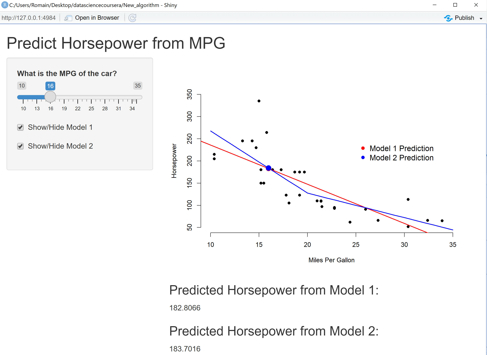

New shiny app
========================================================
author: Romain Frelot
date: 08/09/2021
autosize: true

First Slide
========================================================

This shiny application has been created to play with the MPG variable in the 
mtcars dataset.

There are 3 interactive button:
- the sliderbar to change MPG value between 10 to 35
- a button to show or hide the linear model 1
- a button to show or hide the linear model 1

Slide With shinyUI Code
========================================================


```r
library(shiny)
shinyUI(fluidPage(

    # Application title
    titlePanel("Predict Horsepower from MPG"),

    # Sidebar with a slider input for number of bins
    sidebarLayout(
        sidebarPanel(
            sliderInput("sliderMPG","What is the MPG of the car?",10,35, value= 20),
            checkboxInput("showModel1","Show/Hide Model 1", value = TRUE),
            checkboxInput("showModel2","Show/Hide Model 2", value = TRUE)
        ),

        # Show a plot of the generated distribution
        mainPanel(
            plotOutput("plot1"),
            h3("Predicted Horsepower from Model 1:"),
            textOutput("pred1"),
            h3("Predicted Horsepower from Model 2:"),
            textOutput("pred2")
        )
    )
))
```

<!--html_preserve--><div class="container-fluid">
<h2>Predict Horsepower from MPG</h2>
<div class="row">
<div class="col-sm-4">
<form class="well" role="complementary">
<div class="form-group shiny-input-container">
<label class="control-label" id="sliderMPG-label" for="sliderMPG">What is the MPG of the car?</label>
<input class="js-range-slider" id="sliderMPG" data-skin="shiny" data-min="10" data-max="35" data-from="20" data-step="1" data-grid="true" data-grid-num="8.33333333333333" data-grid-snap="false" data-prettify-separator="," data-prettify-enabled="true" data-keyboard="true" data-data-type="number"/>
</div>
<div class="form-group shiny-input-container">
<div class="checkbox">
<label>
<input id="showModel1" type="checkbox" checked="checked"/>
<span>Show/Hide Model 1</span>
</label>
</div>
</div>
<div class="form-group shiny-input-container">
<div class="checkbox">
<label>
<input id="showModel2" type="checkbox" checked="checked"/>
<span>Show/Hide Model 2</span>
</label>
</div>
</div>
</form>
</div>
<div class="col-sm-8" role="main">
<div id="plot1" class="shiny-plot-output" style="width:100%;height:400px;"></div>
<h3>Predicted Horsepower from Model 1:</h3>
<div id="pred1" class="shiny-text-output"></div>
<h3>Predicted Horsepower from Model 2:</h3>
<div id="pred2" class="shiny-text-output"></div>
</div>
</div>
</div><!--/html_preserve-->

Slide With shinyServer Code
========================================================


```r
library(shiny)
shinyServer(function(input, output) {
    mtcars$mpgsp<-ifelse(mtcars$mpg- 20 > 0,mtcars$mpg- 20, 0)
    model1 <- lm(hp ~ mpg,data = mtcars)
    model2 <- lm(hp ~ mpgsp + mpg,data = mtcars)
    
    model1pred <- reactive({
        mpgInput <- input$sliderMPG
        predict(model1, newdata = data.frame(mpg = mpgInput))
    })
    
    model2pred <- reactive({
        mpgInput <- input$sliderMPG
        predict(model2,newdata =
                    data.frame(mpg = mpgInput,
                               mpgsp=ifelse(mpgInput-20>0,
                                            mpgInput-20,0)))
    })
    
    output$plot1 <- renderPlot({
    mpgInput<-input$sliderMPG
    
    plot(mtcars$mpg, mtcars$hp, xlab = "Miles Per Gallon",
         ylab = "Horsepower",bty = "n",pch = 16,
         xlim = c(10,35),ylim = c(50,350))
    if(input$showModel1){
        abline(model1,col= "red", lwd = 2)
    }
    if(input$showModel2){
        model2lines <- predict(model2, newdata=data.frame(
            mpg=10:35,mpgsp=ifelse(10:35-20>0,10:35-20,0)
        ))
        lines(10:35,model2lines,col="blue",lwd=2)
    }
    legend(25,250,c("Model 1 Prediction","Model 2 Prediction"),pch=16,
           col=c("red","blue"),bty="n",cex=1.2)
    points(mpgInput, model1pred(),col = "red",pch = 16,cex = 2)
    points(mpgInput, model2pred(),col = "blue",pch = 16,cex = 2)
    })
    output$pred1<-renderText({
        model1pred()
    })
    output$pred2<-renderText({
        model2pred()
    })
})
```

View of the shiny App
========================================================

